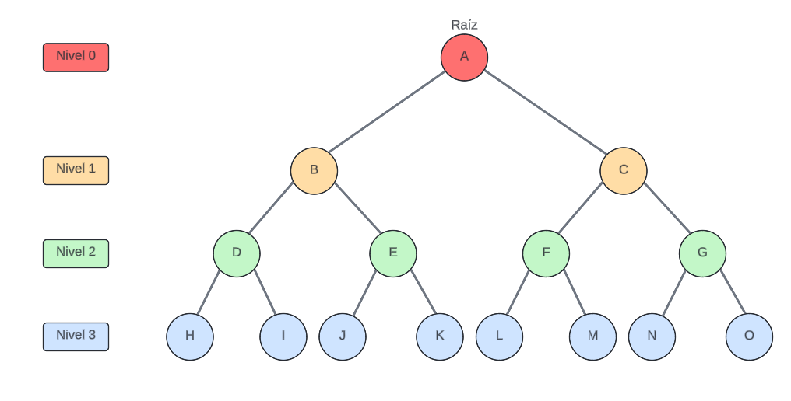
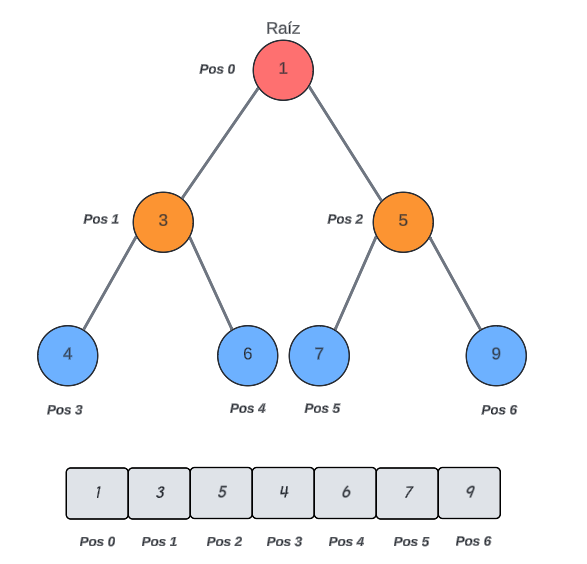
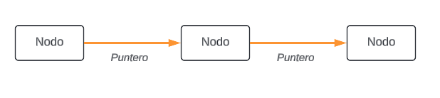

# Estructuras de datos Montículo y Lista Enlazada

> ***Juarez, Gustavo Leonel***

## Introducción

> Aquí, citando fuentes bibliográficas, define `Estructura de Dato`,
`Tipo de dato` y `tipo de dato abstracto`.

## Montículo binario

> Define los conceptos de *arbol binario* y *montículo binario*. Describe
los montículos binarios de máximo y de mínimo. Explica las operaciones básicas
de inserción de un nuevo dato y remoción del máximo o mínimo. Describe la
implementación de un montículo binario utilizando un arreglo.

Para lograr definir que es un *`Montículo binario`*, en primer lugar debemos conocer el concepto
de *Árbol* y **Árbol binario**.

Un *"Árbol"* es una estructura de datos muy importante en informática y en ciencias de la computación. Los arboles son estructuras no lineales, al contrario que los *array* y las *listas enlazadas*, que constituyen estructuras lineales. De forma intuitiva tenemos que el concepto de arbol implica una estructura en la cual los datos se organizan de modo que los elementos de información están relacionadaos entre sí a través de ramas.

Entonces en una estructura de datos *"un Árbol consta de un conjunto finito de elementos, denominados **nodos**, y un conjunto finito de lineas dirigidas, denominadas ramas, que conectan los nodos. El número de ramas asociado con un nodo es el grado del nodo"*(Jhoanes Aguilar,Zahonero Martinez, 2005).

En un *Árbol*, dependiendo de la posicion de los nodos, se pueden denominar de formas diferentes. Por ejemplo, el primer nodo de un *Árbol* que no está vacío se llama raíz. Entonces, un nodo puede ser considerado como *"padre"* si tiene nodos sucesores, los cuales son considerados como *"hijos"*. Al recorrer el *Árbol* podemos denominar como *"descendencia"* a los hijos de un nodo y como *"ascendencia"* a los *"padres" o "abuelos"* de un nodo. Por ultimo, de denomina el nivel de un nodo como la distancia entre este y la raíz, es decir, la cantidad de nodos entre estos.

Decimos que un *"Árbol"* está equilibrado cuando, dado un número máximo de *k* hijos para cada nodo y síendo la altura del árbol *h*. cada nodo de nivel *l < h - 1* tiene exactamente *k* hijos. El árbol está equilibrado perfectamente cuando cada nodo de nivel *l < h* tiene exactamente *k* hijos.

*Árbol binario: "Un árbol binario es un árbol en el que ningún nodo puede tener más de dos "hijos". En este, cada nodo puede tener cero, uno o dos "hijos". Se conoce el nodo de la izquierda como hijo izquierdo y el de la derecha como hijo derecho."*(Jhoanes Aguilar,Zahonero Martinez, 2005).

>*Figura 1: Árbol binario completamente balanceado.*

Otra caracteristica que tienen los Arboles es que la Raíz no necesariamente es el maximo, tambien pueden ser el minimo dando lugar a un arbol invertido.

Luego de haber definido el concepto de *"árbol"* y de *árbol binario*, podemos determinar que es lo que se conoce como *`Montículo binario`*, pues *"un `Montículo binario` de tamaño n se define como un árbol binario casi completo de n nodos, tal que el contenido de cada nodo es menor o igual que el contenido de sus hijos."*(Jhoanes Aguilar,Zahonero Martinez, 2005).

A diferencia del *árbol binario*, el *`Montículo binario`* tiene la particularidad que su raíz es el máximo o el mínimo de los nodos que lo conforman, dependiendo de que clase de monticulo se realice (monticulos de maximo o monticulos de minimos), de igual forma los *"padres"* deben cumplir esta condición con sus respectivos *"hijos"*. Además, el *"hijo de la izquierda"* debe ser menor que el *"padre"*, en cambio el *"hijo de la derecha"* debe ser mayor que el *"padre"*. Entonces, a la hora de insertar o quitar algun elemento del montículo se debe comprobar que ésta condicion se cumpla para los nuevos y antiguos elementos.

Por otro lado, el montículo tiene la particularidad que sus elementos pueden ser ubicados en un arreglo de manera tal que se recorre el *árbol* de izquierda a derecha y de ésta misma forma se van colocando los elementos en el arreglo.

## Lista enlazada

> Define el concepto de *lista enlazada*. Explica como está constituida una
lista simplemente enlazada, los conceptos de *nodo*, *cabeza* y *cola*.
Describe las operaciones de *obtener cabeza*, *obtener cola* y *eliminar cabeza*

Antes de definir que es una ***`Lista Enlazada`***, debemos comprender que es una **Lista**.
Una **Lista** es un Arreglo unidimensional que forma una estructura lineal de elementos
homogeneos, esto implica que se debe fijar su memoria por adelantado. Por lo tanto 
podemos considerar a la **Lista** como una *"estructura de datos estatica"*, pues el tamaño
de la memoria se establece durante la compilación y permanece inalterable durante la ejecución
del programa.

En cambio, una ***`Lista Enlazada`*** es una estructura de datos dinamica, es decir que su tamaño 
de memoria crece y se contrae a medida que se ejecuta el programa. Entonces podemos definir el 
concepto de ***`Lista Enlazada`*** como: *"Una `Lista Enlazada` es una colección o secuencia de*
*elementos dispuestos uno detrás de otro, en la que cada elemento se conecta al siguiente por un*
*"enlace" o "puntero""*(Jhoanes Aguilar,Zahonero Martinez, 2005).

La idea basica de una *`Lista Enlazada`* consiste en construir una lista cuyos elementos llamados
**"nodos"** se componen de dos partes o *campos*:
* La primera parte o *campo* contiene la información y es un valor de una tipo generico.
* La seguda parte o *campo* es un puntero que apunta al siguiente elemento de la lista.

>*Figura 3: `Lista Enlazada`(representación simple)*

Las *`Lista Enlazada`* se pueden dividir en cuatro categorias:
- *Listas simplemente enlazadas*
- *Listas doblemente enlazadas*
- *Lista circular simplemente enlazada*
- *Lista circular doblemente enlazada*

Nuestro estudio está centrado solamente en las *Listas Simplemente Enlazadas*, donde cada nodo (elemento)
contiene un único enlace que conecta ese nodo al nodo siguiente o nodo sucesor. La lista es eficiente en 
recorridos directos.

La figura 3 presenta una representacion simplificada de la estructura de una *`Lista Enlazada`*. Para poder 
completarla necesitamos definir dos conceptos fundamentales en una lista, **Cabeza** y **Cola**:
- La **Cabeza** de la lista es el primer nodo de ésta, donde su primer campo esta vacío y en el segundo se 
encuentra el puntero al siguiente nodo.
- La **Cola** de la lista es el ultimo nodo que posee ésta, en su primer campo se encuentra el ultimo dato 
de la estructura y el segundo esta vacío, pues no existe un siguiente elemento.

>*Figura 4: Representación completa de una lista enlazada*

