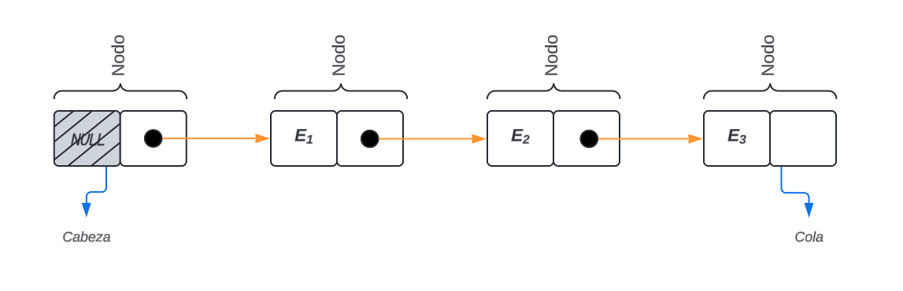

# Estructuras de datos Montículo y Lista Enlazada

> Autor

## Introducción

> Aquí, citando fuentes bibliográficas, define `Estructura de Dato`,
`Tipo de dato` y `tipo de dato abstracto`.

## Montículo binario

> Define los conceptos de *arbol binario* y *montículo binario*. Describe
los montículos binarios de máximo y de mínimo. Explica las operaciones básicas
de inserción de un nuevo dato y remoción del máximo o mínimo. Describe la
implementación de un montículo binario utilizando un arreglo.

## Lista enlazada

> Define el concepto de *lista enlazada*. Explica como está constituida una
lista simplemente enlazada, los conceptos de *nodo*, *cabeza* y *cola*.
Describe las operaciones de *obtener cabeza*, *obtener cola* y *eliminar cabeza*

Antes de definir que es una ***`Lista Enlazada`***, debemos comprender que es una **Lista**.
Una **Lista** es un Arreglo unidimensional que forma una estructura lineal de elementos
homogeneos, esto implica que se debe fijar su memoria por adelantado. Por lo tanto 
podemos considerar a la **Lista** como una *"estructura de datos estatica"*, pues el tamaño
de la memoria se establece durante la compilación y permanece inalterable durante la ejecución
del programa.

En cambio, una ***`Lista Enlazada`*** es una estructura de datos dinamica, es decir que su tamaño 
de memoria crece y se contrae a medida que se ejecuta el programa. Entonces podemos definir el 
concepto de ***`Lista Enlazada`*** como: *"Una `Lista Enlazada` es una colección o secuencia de*
*elementos dispuestos uno detrás de otro, en la que cada elemento se conecta al siguiente por un*
*"enlace" o "puntero""*(Jhoanes Aguilar,Zahonero Martinez, 2005).

La idea basica de una *`Lista Enlazada`* consiste en construir una lista cuyos elementos llamados
**"nodos"** se componen de dos partes o *campos*:
* La primera parte o *campo* contiene la información y es un valor de una tipo generico.
* La seguda parte o *campo* es un puntero que apunta al siguiente elemento de la lista.

*Figura 3: `Lista Enlazada`(representación simple)*

Las *`Lista Enlazada`* se pueden dividir en cuatro categorias:
- *Listas simplemente enlazadas*
- *Listas doblemente enlazadas*
- *Lista circular simplemente enlazada*
- *Lista circular doblemente enlazada*

Nuestro estudio está centrado solamente en las *Listas Simplemente Enlazadas*, donde cada nodo (elemento)
contiene un único enlace que conecta ese nodo al nodo siguiente o nodo sucesor. La lista es eficiente en 
recorridos directos.

La figura 3 presenta una representacion simplificada de la estructura de una *`Lista Enlazada`*. Para poder 
completarla necesitamos definir dos conceptos fundamentales en una lista, **Cabeza** y **Cola**:
- La **Cabeza** de la lista es el primer nodo de ésta, donde su primer campo esta vacío y en el segundo se 
encuentra el puntero al siguiente nodo.
- La **Cola** de la lista es el ultimo nodo que posee ésta, en su primer campo se encuentra el ultimo dato 
de la estructura y el segundo esta vacío, pues no existe un siguiente elemento.

